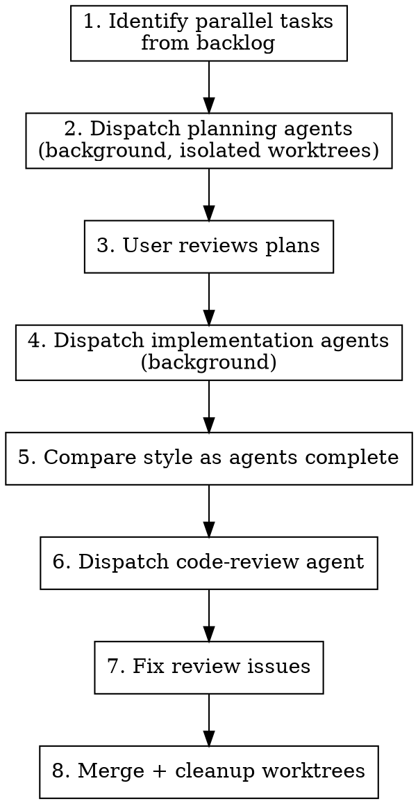

# Parallel Task Orchestration

## Overview

Orchestrate batches of independent tasks by dispatching background subagents in isolated git worktrees. You are the **orchestrator** — you coordinate, compare, and review. All actual work (research, planning, implementation) happens in subagents.

**Core principle:** Never do the work yourself. Dispatch, monitor, compare, review.

## When to Use

- 2+ backlog tasks share no dependencies on each other
- All blocking dependencies are already resolved (check `Dependencies:` field)
- Tasks touch different files (no merge conflicts between agents)

**When NOT to use:**
- Tasks have sequential dependencies (A must finish before B starts)
- Tasks modify the same files (merge conflicts)
- Single task (just do it directly)

## Workflow



## Naming Conventions

| Thing | Pattern | Example |
|-------|---------|---------|
| Worktree branch | `feat/task-{id}` | `feat/task-004` |
| Worktree directory | `.claude/worktrees/feat-task-{id}` | `.claude/worktrees/feat-task-004` |

## Phase 1: Identify Parallel Tasks

1. List backlog tasks, check dependencies
2. Filter to tasks whose dependencies are all `Done`
3. Verify tasks touch different files (no overlap)
4. Present the batch to the user for confirmation

## Phase 2: Planning (Background Agents in Worktrees)

Dispatch one background agent per task with `isolation: "worktree"`.

Each planning agent must:
- Research the codebase (existing patterns, schema, design docs)
- Use context7 for up-to-date library documentation
- Read `docs/design/` thoroughly
- Write a detailed implementation plan
- Save the plan to the backlog ticket

**Agent prompt template for planning:**
```
You are planning TASK-{ID}: "{title}". Produce a detailed implementation
plan — do NOT write implementation code.

Research: read existing code patterns, migrations, design docs in docs/design/,
model types. Use context7 for library docs. Read CLAUDE.md.

Read the backlog skill to interface with the backlog. Write plan to the backlog ticket covering:
1. Context Summary  2. File Changes  3. Method Signatures
4. SQL Queries  5. Edge Cases  6. Testing Strategy  7. Open Questions
```

**After all planning agents return:**
- Save each plan to its backlog ticket (use backlog MCP tools)
- Set ticket status to "In Progress"
- Present plans to user for review

## Phase 3: Implementation (Background Agents)

After user approves plans, dispatch implementation agents.

Each implementation agent must:
- Load relevant project skills (e.g., `go-htmx-fullstack`)
- Load `superpowers:test-driven-development`
- Load `superpowers:verification-before-completion`
- Use context7 for library docs
- Follow the approved plan
- Run tests, verify build
- Commit to its branch
- Update acceptance criteria in backlog

**Agent prompt template for implementation:**
```
You are implementing TASK-{ID}: "{title}".

Setup:
1. Load the go-htmx-fullstack skill
2. Load superpowers:test-driven-development
3. Load superpowers:verification-before-completion

Read the plan from backlog (TASK-{ID}). Use context7 for library docs.
Read CLAUDE.md. Follow the plan. Write tests. Verify build + tests pass.
Commit with descriptive message. Update acceptance criteria in backlog.
Do NOT mark the task as complete.
```

## Phase 4: Cross-Agent Comparison

As implementation agents complete one by one:

1. **Read each agent's generated code immediately**
2. **Track a style fingerprint** across agents:
   - Return types (value vs pointer, domain model vs generated types)
   - Error handling (raw propagation vs `fmt.Errorf` wrapping)
   - Custom interfaces or types introduced
   - Test patterns (helpers, naming, subtests)
   - Transaction management approach
3. **Flag divergences** — present a comparison table to the user

This is critical because independent agents will make different style choices. Catch inconsistencies before they calcify.

## Phase 5: Code Review

After all agents complete, dispatch the `superpowers:code-reviewer` agent with:
- The git diff range (base SHA to head SHA)
- The cross-agent consistency divergences you identified
- References to the backlog task plans as requirements

## Phase 6: Fix + Cleanup

1. Dispatch a fix agent to resolve review issues systematically
2. Merge worktree branches locally (or note if agents wrote to main)
3. Clean up worktrees: `git worktree remove` + `git branch -D`
4. Verify final build + tests

## Orchestrator Checklist

As the orchestrator, you should ONLY:
- [ ] Query the backlog for tasks and dependencies
- [ ] Dispatch background agents with detailed prompts
- [ ] Read completed agents' output and generated code
- [ ] Compare implementation styles across agents
- [ ] Present status updates and comparison tables to the user
- [ ] Dispatch review and fix agents
- [ ] Clean up worktrees and branches

You should NEVER:
- Write implementation code yourself
- Duplicate research that agents are doing
- Make architectural decisions without user input
- Mark tasks as complete (user does this)

## Common Mistakes

| Mistake | Fix |
|---------|-----|
| Doing research yourself while agents run | Trust the agents — read their output when done |
| Launching agents without detailed prompts | Include all context; agents start fresh with no history |
| Forgetting to compare styles across agents | Read each agent's code as it completes, build comparison table |
| Not specifying skill loading in agent prompts | Agents don't inherit your skills — tell them which to load |
| Skipping code review after parallel work | Independent agents WILL diverge — review catches this |
| Leaving worktrees behind | Always clean up: remove worktrees, delete branches |
